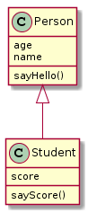

# 题目

**1.判断字符串是否合法，规则为第一个必须是字母，后面可以是字母、数字、下划线，总长度为5-20，写出对应的正则表达式。**

```java
Pattern.compile("^[a-zA-Z]{1}\\w{4,19}");
```

**2.指出下面程序的运行结果：**

```java
class A{
    static{
        System.out.print("1");
    }
    public A(){
        System.out.print("2");
    }
}
class B extends A{
    static{
        System.out.print("a");
    }
    public B(){
        System.out.print("b");
    }
}
public class Hello{
    public static void main(String[] args){
        A ab = new B();//执行到此处，结果是（1a2b）
        ab = new B();//执行到此处，结果是（2b）
    }
}
```

**3.Java编程题：请使用任意一种排序算法，对int[] intArr = {5,9,1,4,1,2,6,3,8,0,7}进行排序**

```java
//插入排序
public void insertSort(int[] arr){
    int n = arr.length;
    for(int i = 1; i < n; i++){
        int temp = arr[i];//待插入数
        int j = i - 1;//有序组最后一个数的下标
        //再有序组中找插入位置
        while( j >= 0 && temp < arr[j] ){
            arr[j+1] = arr[j];
            j--;
        }
        //找到插入位置，插入待插入数
        arr[j+1] = temp;
    }    
}

//冒泡排序
public void bubbleSort(int[] arr){
    int n = arr.length - 1;
    for(int i = 0; i < n; i++){//控制比较的趟数
        for(int j = 0; j < n-i; j++){
            if(arr[j]>arr[j+1]){//两两比较
                int temp = arr[j];
                arr[j] = arr[j+1];
                arr[j+1] = temp;
            }
        }
    }
}

//选择排序
public void selectSort(int[] arr){
    int n = arr.length;
    for(int i = 0; i < n; i++){
        int min = i;
        //找最小值的下标
        for(int j = i+1; j<n; j++){
            if(arr[j]<arr[min]){
                min = j;
            }
        }
        //交换
        int temp = arr[i];
        arr[i] = arr[min];
        arr[min] = temp;        
    }

}

```

**4.Java编程题：判断一个整数是否是对称数（它的各位数字如果是左右对称的，则称这个数是对称数，例如：1234321、123321等）**

```java
//方法1
public static boolean isSymmetrical(int num){
    String numStr = num+"";
    char[] arr = numStr.toCharArray();
    int len = arr.length;
    int half = arr.length / 2;
    boolean flag = true;
    for(int i = 0; i < half; i++){
        System.out.println(arr[i]);
        flag = flag && (arr[i]==arr[len-1-i]);
    }
    return flag;
}
//方法2
public static boolean isSymmetrical2(int num){
    String plain = num + "";
    StringBuilder sb = new StringBuilder(plain);
    String result = sb.reverse().toString();        
    return result.equals(plain);
}
```

**5.Java编程题：编写一个方法，输入一个字符串数组，返回逗号拼接的字符串。例如：输入String[] arr = {"AA","BB","CC"}，返回："AA,BB,CC"**

```java
//方法1
public static String appendStr(String[] arr){
    StringBuilder sb = new StringBuilder();
    for (String str : arr){
    	sb.append(str).append(",");
    }
    sb.deleteCharAt(sb.lastIndexOf(","));
    return sb.toString();
}
//方法2
public static String appendStr2(String[] arr){
    String str = Arrays.toString(arr);
    return str.replaceAll("[\\[\\]\\s]","");//利用正则替换不需要的字符串内容
}
```

**6.JavaScript语言中的基本类型又哪些？**

1. 基本数据类型： `Undefined, Null, Boolean, Number, String`
    - 基本类型值是指简单的数据段，5种基本类型是按值访问的，因为可以操作保存在变量中的实际值
    - 基本类型的值在内存中占据固定大小的空间，被保存在栈内存中。从一个变量向另一个变量复制基本类型的值，会创建这个值的一个副本。
    - 不能给基本类型的值添加属性

2. 引用数据类型：`Object`
  - 引用类型值是指那些可以由多个值构成的对象。js不允许直接访问内存中的位置，也就是不能直接访问操作对象的内存空间。在操作对象时，实际上是在操作对象的引用而不是实际的对象。
  - 引用类型的值是对象，保存在堆内存中，包含引用类型值的变量实际上包含的并不是对象本身，而是一个指向该对象的指针。从一个变量向另一个变量复制引用类型的值，复制的其实是指针，因此两个变量最终都指向同一个对象。
  - 对于引用类型的值，可以为其添加属性和方法，也可以改变和删除其属性和方法

**7.JavaScript编程题：写一个Student类集成Person类的例子，对应的类图如下：**




```
function Person(age, name) {
  this.age = age;
  this.name = name;
  this.sayHello = function(){
    console.log("Person say hello...");
  }
}

function Student(score){ 
  this.score = score;
  this.sayScore = function(){
    console.log("Student say Score...");
  }
}

Student.prototype = new Person(11,'cai');
```


